출처: https://code.visualstudio.com/docs/editor/debugging#_launch-configurations

### 디버깅

비스-코드(Visual Studio Code)의 주요 특징중 하나는 훌륭한 디버깅지원이다. 비스-코드에 내장된 디버거는 자신의 편집, 컴파일 그리고 디버그 도돌이 가속을 도와준다.

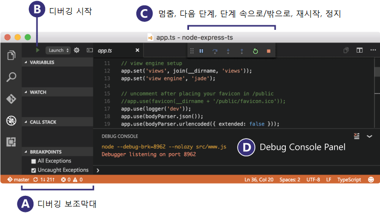

#### 확장디버거

비스-코드는 실행중에 [`Node.js`](https://nodejs.org/)에 대해 내장 디버깅을 지원한다 그리고 자바스크립트(JavaScript), 타입스크립트(TypeScript)를 디버그 할수 있다, 그리고 자바스크립트(JavaScript)로 변환된 모든 다른 언어도.

다른언어와 실행중 디버깅을 위해([PHP](https://marketplace.visualstudio.com/items?itemName=felixfbecker.php-debug), [Ruby](https://marketplace.visualstudio.com/items?itemName=rebornix.Ruby), [Go](https://marketplace.visualstudio.com/items?itemName=ms-vscode.Go), [C#](https://marketplace.visualstudio.com/items?itemName=ms-vscode.csharp), [Python](https://marketplace.visualstudio.com/items?itemName=ms-python.python), [C++](https://marketplace.visualstudio.com/items?itemName=ms-vscode.cpptools), [Powershell](https://marketplace.visualstudio.com/items?itemName=ms-vscode.PowerShell) 그리고 [이외 많은것](https://marketplace.visualstudio.com/search?term=debug&target=VSCode&category=Debuggers&sortBy=Relevance)), 우리의 비스-코드 [장마당](https://marketplace.visualstudio.com/vscode/Debuggers)에서 [`확장`](https://code.visualstudio.com/docs/editor/extension-gallery)`디버거`를 찾는다 아니면 디버그메뉴 상단에서 `추가디버거 설치(Install Additional Debuggers)`를한다.

아래는 디버깅 지원이 포함된 몇가지 인기있는 확장이다:

| [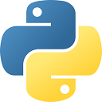](https://marketplace.visualstudio.com/items?itemName=ms-python.python) | [](https://marketplace.visualstudio.com/items?itemName=ms-vscode.cpptools) | [](https://marketplace.visualstudio.com/items?itemName=ms-vscode.csharp) | [](https://marketplace.visualstudio.com/items?itemName=msjsdiag.debugger-for-chrome) |  
| :---: | :---: | :---: | :---: |  
| **파이썬** | **C/C++** | **C#** | **크롬** |

> 덧글: 위에 보이는 확장은 동적으로 물어본다. 위의 확장을 눌러 설명을 읽어라 그리고 나에게 가장 적합한 확장인지 결정하기위한 검토를 한다.


### 디버깅 시작

다음 문서는 내장된 [`Node.js`](https://nodejs.org/) 디버거를 기반으로 한다, 하지만 대부분의 개념과 특징은 다른 디버거에도 잘 적용할수 있다.

이것은 먼저 **Node.js** 적용 표본을 생성하는 것이 도움이 된다 디버깅에 대해 읽기 전에. **Node.js** 를 설치하기 위해 **Node.js** 에 대한 자세한설명을 따를수 있다 그리고 자바스크립트 적용(app.js) 간단한 "Hello World"를 생성할수 있다. 일단 간단한 적용을 모두 설정했다면, 이 페이지는 비스-코드를 통해 디버깅 특징을 안내한다.


### 디버그 보기

디버그보기를 띄우기 위해, 비스-코드의 옆에 있는 활성막대(Activity Bar)에서 디버그 상징을 누른다. 또한 단축키 `Ctrl+Shift+D`도 사용할수 있다.


디버그보기는 디버깅에 관련된 모든정보를 표시한다 그리고 상단막대에 디버깅 명령과 구성설정이 있다.


### 디버그 메뉴

상단의 **디버그** 메뉴에는 가장 일반적인 디버그 명령이 있다:

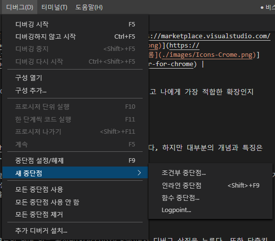


### 시발 구성

비스-코드에서 간단한 앱을 디버그하기 위해, `F5`를 누른다 그러면 비스-코드는 현재 활성화된 파일을 디버그하기 위한 시도를 할 것이다.

하지만, 디버깅 각본 대부분에 대해, 시발 구성파일을 생성하는 것이 유용하다 왜냐하면 디버깅 설정을 상세하게 구성하고 저장하는 것을 허용하기 때문이다. 비스-코드는 자신의 작업공간(과제 뿌리 폴더)에서 `.vscode` 폴더 안에 위치한 `launch.json` 파일에 디버깅 구성정보를 보관한다 또는 자신의 사용자설정 또는 작업공간설정 에서.

`launch.json` 파일을 생성하기 위해, 비스-코드(**파일 -> 폴더 열기**)에서 자신의 프로젝트폴더를 연다 그런다음 디버그보기 상단막대에서 구성 톱니상징을 누른다.

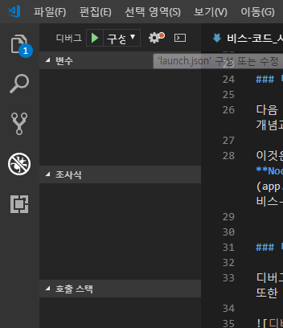

비스-코드는 자신의 디버그 환경을 자동으로 감지하려고 시도할 것이다, 하지만 만약 실패하면, 수동으로 선택해야 한다:

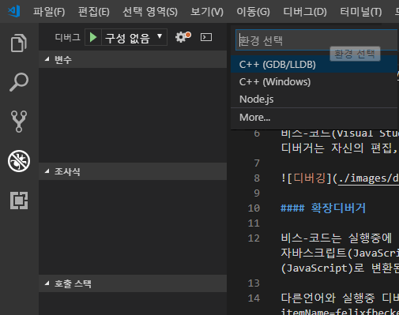

이것은 `Node.js` 디버깅을 위해 `launch.json` 파일에 생성된 시발구성 이다:

``` json
{
    // IntelliSense를 사용하여 가능한 특성에 대해 알아보세요.
    // 기존 특성에 대한 설명을 보려면 가리킵니다.
    // 자세한 내용을 보려면 https://go.microsoft.com/fwlink/?linkid=830387 을(를) 방문하세요.
    "version": "0.2.0",
    "configurations": [
        {
            "type": "node",
            "request": "launch",
            "name": "Launch Program",
            "program": "${file}"
        }
    ]
}
```

만약 파일탐색기 보기(`Ctrl+Shift+E`)로 돌아가면, 비스-코드가 생성한 `.vscode` 폴더를 볼수있다 그리고 자신의 작업공간에 `launch.json` 파일이 추가된 것을.

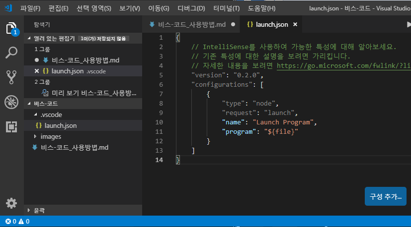

> 알림: 비스-코드에서 폴더를 열지 않아도 간단한 어플을 디버그할수 있다, 하지만 시발구성 관리와 향상된 디버깅 설정을 할수 없다. 비스-코드 하단의 상태막대가 보라색이면 폴더가 열려있지 않은 경우이다.

시발구성에서 가능한 속성은 디버거마다 다르다는 것을 알린다. 지능적감지(IntelliSense) 제안(`Ctrl+Space`)을 사용하여 특정 디버거를 위해 존재하는 속성을 알아낼수 있다. 떠돌이 도움말은 모든 속성에 대해서도 또한 가능하다.

하나의 디버거에서 사용할수 있는 속성이 다른 디버거에서도 또한 자동적으로 작동한다고 가정하지 마라. 만약 자신의 시발구성에서 녹색 물결이 보이면, 문제가 무엇인지 알기 위해 그 위에 마우스를 띄워라 그리고 디버그 활동 시발전에 수정하라.

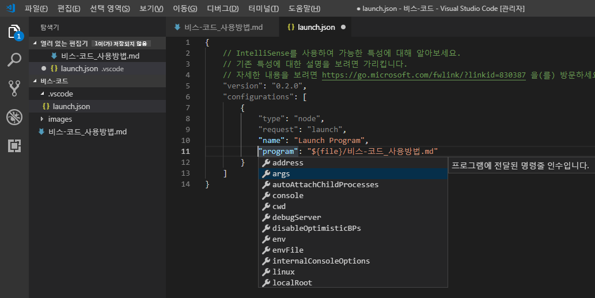

자동적으로 생성된 값 모두를 검토한다 그리고 자신의 과제와 디버깅 환경에 대해 합당한지 확인한다.

#### 시발구성에 대응하는 붙이기구성

비스-코드에는, 두가지 핵심 디버깅모드가 있다, **시발(Launch)** 과 **붙이기(Attach)**, 이것은 두가지의 작업흐름과 개발자 구분을 처리한다. 자신의 작업흐름에 따라, 무엇이 자신의 과제에 대해 구성유형이 적절한지 알기가 혼란스러울수 있다.

만약 개발자도구 뒤발바지인 펼치개(Browser)가 실행되었다면, "자신의 도구에서 시발"으로 거의 사용되지 않는다, 때문에 자신의 펼치개(Browser) 상태(instance)는 이미 열렸다. 개발자도구를 열면, 자신의 열린 펼치개(Browser) 탭에 개발자도구를 단순히 **붙이기**한다. 한편, 만약 서버 또는 데스크탑 뒤발바지로 실행되었다면, 자신이 가진 편집기가 자신을 위해 자신의 프로세스를 **시발**하는 것이 아주 정상적인 것이다, 그리고 자신의 편집기는 자동적으로 새롭게 시발된 프로세스에 디버거를 붙이기한다.

**시발**과 **붙이기** 사이의 차이를 설명하기위한 가장좋은 방법은 여기(이것)에 비스-코드를 붙이기하기 **전에** 디버그모드에서 자신의 어플을 시작하는 방법에 대한 방안으로 **시발**구성을 생각하는 것이다, 붙이기구성은 **이미** 실행중인 어플 또는 프로세스에 비스-코드 디버거를 연결하는 방법에 대한 방안이다.

비스-코드 디버거는 일반적으로 디버그모드에서 이미실행중인 계획에 디버거모드 또는 붙이기로 계획(Program)의 시발을 지원한다. 요청(`붙이기(attach)` 또는 `시발(launch)`)에 따라, 다른 속성이 필요하다, 그리고 비스-코드의 `launch.json` 검증과 제안이 도움이 될 것이다.


#### 새로운 구성 추가

기존의 `launch.json`에 새로운 구성을 추가하기 위해, 다음 기술중 하나를 사용하라:

- 지능적감지를 사용한다, 만약 커서가 구성 배열 안쪽에 위치했다면.
- 배열의 시작부분에서 지능적감지로 한토막(snippet)을 불러오기 위해 **구성추가** 버튼을 누른다.
- 디버그 메뉴에서 **구성추가** 선택사항을 선택한다.


비스-코드는 또한 동시에 다중구성을 시작하기 위한 복합 시발구성을 지원한다; 자세한 사항은, 이 [단락](https://code.visualstudio.com/docs/editor/debugging#_compound-launch-configurations)을 봐라.

디버그 동안(session)을 시작하기 위해, 먼저 디버그 보기에서 **구성 떨굼**을 사용하여  **Launch Program**이라는 이름의 구성을 선택한다. 일단 자신의 시발 구성집합을 가지고 있다면, `F5`로 자신의 디버그 동안(session)을 시작한다.

아니면 **명령그릇**(Command Palette, `Ctrl+Shift+P`)을 통해 자신의 구성을 실행할수 있다, `디버그: 디버깅 선택및 시작` 한정으로 아니면  `디버그`를 타자 그리고 디버그로 원한는 구성을 선택한다.

디버그 동안을 시작 하자마자, **디버그 콘솔** 제어반이 표시된다 그리고 디버그 출력이 보인다, 그리고 상태막대 생상이 바뀐다(기본테마 색인 경우 주황색):

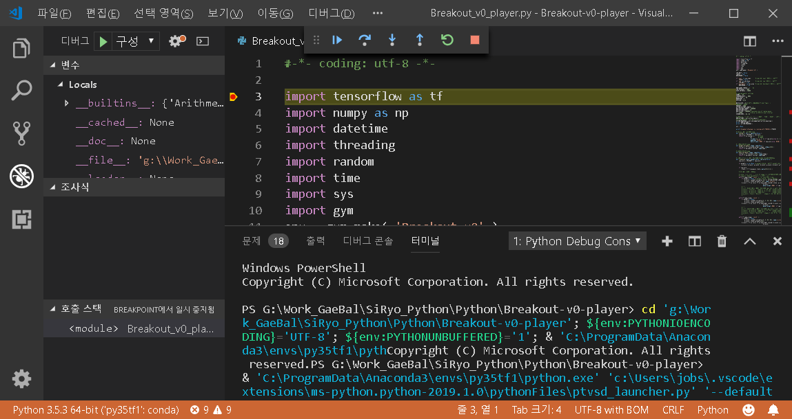

게다가, 활성 디버그구성을 보여주는 상태막대에  **디버그 상태**가 나타난다. 디버그 상태를 누르면, 사용자는 활성 시발구성을 변경할수 있다 그리고 디버그 보기를 열지 않고 디버그를 시작한다.

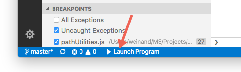


### 디버그 소행

일단 디버그 동안 시작되면, 디버그 도구모음이 편집기 위에 나타난다.


- 계속 (`F5`)
- 단위 실행 (`F10`)
- 단계 들어가기 (`F11`) - 단계 정보
- 단계 나오기 (`Shift+F11`) - 단계 출력
- 다시 시작 (`Ctrl+Shift+F5`)
- 중지 (`Shift+F5`)

> 덧글: 디버그 도구모음의 위치를 제어하기 위해 `debug.toolBarLocation` 설정을 사용한다. 이것은 디버그 보이기 또는 숨기기로 떠돌기(`floating`), 고정(`docked`)을 기본으로 할수 있다. 떠돌기(`floating`) 디버그 도구모음은 편집기 영역안에서 옆으로 또한 아래로 끌수 있다.


#### 실행 모드

계획 디버그 뿐만 아니라, 비스-코드는 계획 **실행**을 지원한다. `디버그: 디버깅하지 않고 시작` 소행은 `Ctrl+F5`로 작동한다 그리고 현재 선택된 시발구성을 사용한다. 시발구성 속성 대부분은 "실행"모드에서 지원된다. 비스-코드는 계획(program)이 실행되는 중에 디버그 동안이 유지된다, 그리고 **중지**버튼을 누르면 계획(program)을 빠져나온다.

> 덧글: **실행** 소행은 항상 가능하다, 하지만 모든 디버거가 "실행"을 확장지원하지 않는다. 이 경우는, "실행"은 "디버그"와 동일하다.


### 중단지점

중단지점은 **편집기 가장자리**를 클릭하여 전환할수 있다. 디버그 보기의 **중단지점** 부분에서 중단지점을 섬세하게 제어(활성, 비활성, 모든 중단점 다시 적용)할수 있다.

- 편집기 가장자리에 있는 중단지점은 보퉁 채워진 빨간 원으로 보인다.
- 비활성 중단지점은 채워진 회색 원이다.
- 디버그시발이 시작되면, 디버거에 등록할수 없는 중단지점은 텅빈 회색 원으로 변경된다. 마찬가지로 **편집하며 계속하기(live-edit)** 지원없이 디버그시발이 동작하는 중에 원본이 변경되었을 경우에도 같다.

**모든 중단점 다시 적용** 명령은 모든 중단지점을 원래위치로 다시 설정한다. 이것은 유용하다 만약 자신의 디버그 환경은 아직 진행되진안흔 소스코드에서 "게으르고" "잘못지정" 중단지점의 경우에도.

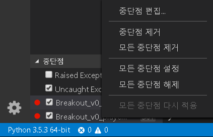


### 기록지점

기록지점은 디버거로 "중단"하지 않는 중단지점의 변형이다 하지만 대신에 제어반(console)으로 소식(console)을 기록한다. 기록지점은 잠시멈춤 또는 중지할수 없는 생성서버를 디버깅하는 중에 찔러넣기 기록이 특히 유용하다.

기록지점은 "마름모" 모양의 상징으로 표현된다. 기록 소식은 순수한 문자이다 하지만 중괄호(`{}`, curly braces) 안에 평가할 표현식을 포함할수 있다.

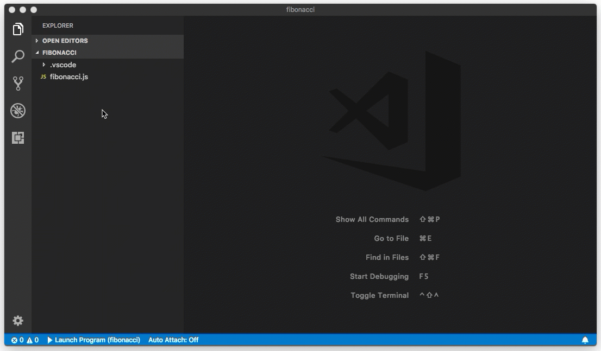

다만 정기적인 중단지점 같은, 기록지점은 활성 또는 비활성 할수 있다 그리고 조건, 도달횟수에 의해 제어할수 있다.

알림: 기록지점은 현재 비스-코드에 내장된 Node.js 디버거만 지원된다, 하지만 다른 확장디버그로 구현할수 있다. [확장 파이썬](https://code.visualstudio.com/docs/python/python-tutorial), 예의 경우, 기록지점을 지원한다.


### 자료 검사

변수는 디버그 보기의 **변수** 구역에서 검사할수 있다 또는 편집기에서 해당 소스위에 띄워
놓으면. 변수의 값과 표현식 평가는 **CALL STACK** 구역에서 선택한 더미구조(stack frame)와 관련이 있다.


변수 값은 변수 상황 메뉴에서 **Set Value** 소행으로 수정할수 있다.

변수와 표현식은 또한 평가ㅎ할수 있다 그리고 디버그 보기의 **조사식(WATCH)** 구역에 관찰한다.


### Launch.json 속성

`launch.json` 속성은 다른 디버거 지원 도우미 그리고 디버깅 각본이 많이 있다. 위에서 언급한 바와 같이, 가능한 속성목록을 보기위해 지능감지(`Ctrl+Space`)를 사용할수 있다 한번 `type`(유형) 속성 값을 지정했다면.

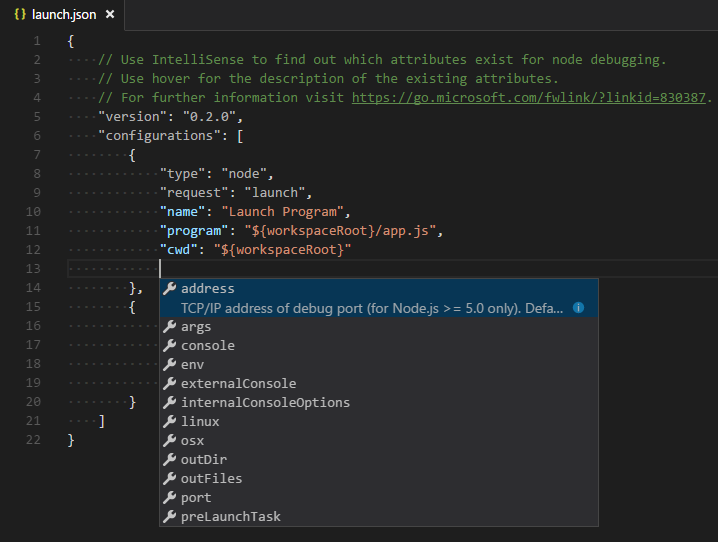

다음은 모든 시발구성에 필수 속성이다:

- `type`(유형): 이 시발구성에 사용할 디버거 유형. 설치된 모든 확장 디버그를 도입할 유형: 내장된 노드 디버거(Node debugger)를 위한 `node`, 예를 들어, PHP 와 Go 확장을 위한 `php` 그리고 `go`
- `request`(요청): 이 시발구성의 요청 유형. 현재, `launch`(시발) 와 `attach`(붙이기) 가 지원된다.
- `name`(이름): 디버그 시발구성 떨굼에서 나타내기 위해 읽기에 친숙한 이름.

이것은 모든 시발구성에서 사용할수 있는 일부 선택적 속성이다.

- `preLaunchTask`: 디버그 동안을 시작하기 전에 시발하기 위한 작업, `tasks.json`에 지정된 작업 이름으로 이 속성을 설정한다(작업공간의 `.vscode` 폴더 안에).
- `postDebugTask`: 디버그 동안의 바로 끝에서 시발하기 위한 작업, `tasks.json`에 지정된 작업 이름으로 이 속성을 설정한다(작업공간의 `.vscode` 폴더 안에).
- `internalConsoleOptions`: 이것은 디버깅 동안 중에 디버그 제어반 보이기 속성 제어.
- `debugServer`: **확장 디버그 작성자만을 위해(for debug extension authors only):** 이것은 디버그 어댑터를 시발하는 대신에 지정된 포트에 내가 연결하는 것을 허용하는 속성이다.

많은 디버가는 다음 속성중 일부를 지원한다.

- `program`: 실행할수 있는 아니면 디버거를 시발할때 실행하기 위한 파일
- `args`: 디버그 하기위해 계획(program)에 전달하는 인수
- `env`: 환경 변수(`null`값은 변수를 "정의해제(undefine)" 하기위해 사용한다)
- `cwd`: 종속성과 다른 파일을 찾기위한 현재 작업 디렉토리(Current Working Directory)
- `port`: 실행프로세스에 붙이기 할때 포트
- `stopOnEntry`: 계획(program)이 시발 했을때 즉시 중지
- `console`: 사용하기 위한 제어반(console)의 종류, 예를 들어, 내부 제어반(console), 통합터미널, 또는 외부터미널


### 변수 대용

비스-코드는 경로를 공통으로 사용한다 그리고 다른 값을 변수로 사용할수 있다 그리고 `launch.json`안의 문자열 내에서 변수 대용을 지원한다.이 의미는 디버그 구성에서 절대경로를 사용할 필요가 없다. 예를들어, `${workspaceFolder}`는 작업공간을 뿌리(root)경로로 제공한다, `${file}`은 활성 편집기에서 파일을 연다, 그리고 `${env:Name}`은 환경변수 "Name". [변수 기준](https://code.visualstudio.com/docs/editor/variables-reference)에서 미리 정의된 변수의 전체 목록을 또는 `launch.json` 문자열 속성 내에서 지증적감지를 호출하여 볼수 있다.

``` json
{
    "type": "node",
    "request": "launch",
    "name": "Launch Program",
    "program": "${workspaceFolder}/app.js",
    "cwd": "${workspaceFolder}",
    "args": [ "${env:USERNAME}" ]
}
```

### 작업틀-지정 속성


``` json
{
    "version": "0.2.0",
    "configurations": [
        {
            "type": "node",
            "request": "launch",
            "name": "Launch Program",
            "program": "${workspaceFolder}/node_modules/gulp/bin/gulpfile.js",
            "args": ["myFolder/path/app.js"],
            "windows": {
                "args": ["myFolder\\path\\app.js"]
            }
        }
    ]
}
```


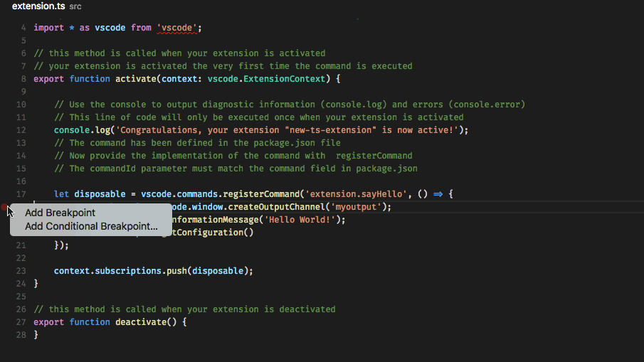


